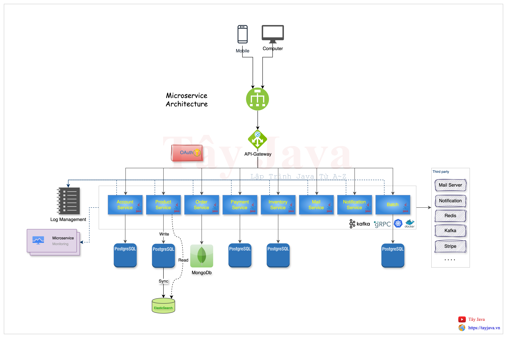
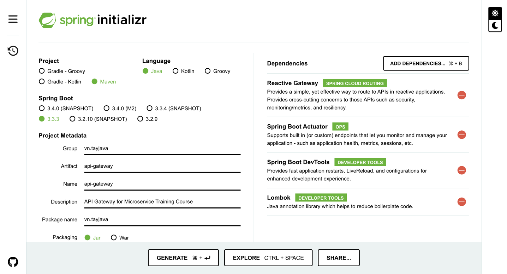
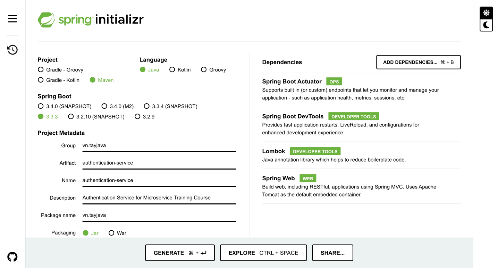
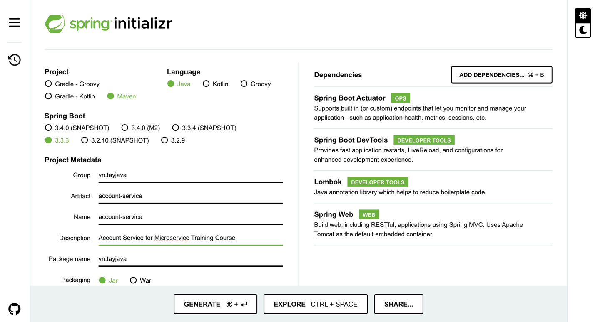
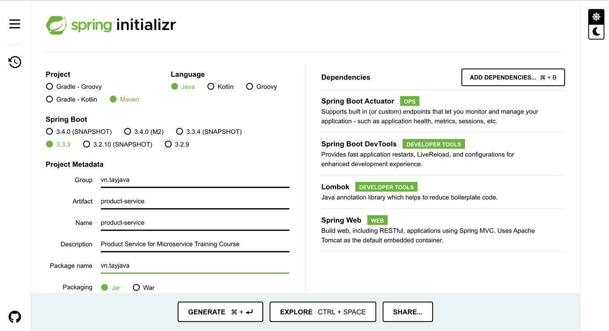
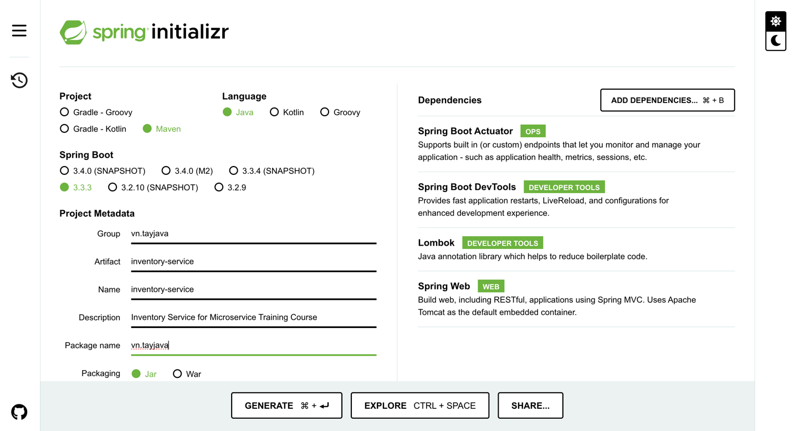
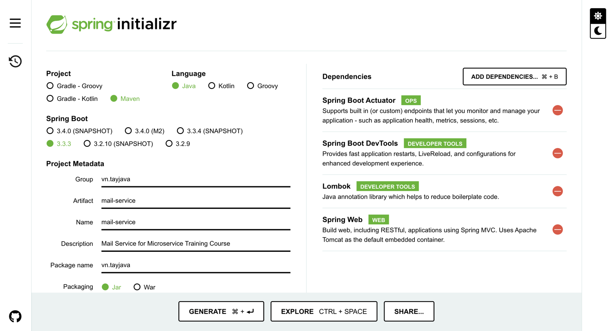
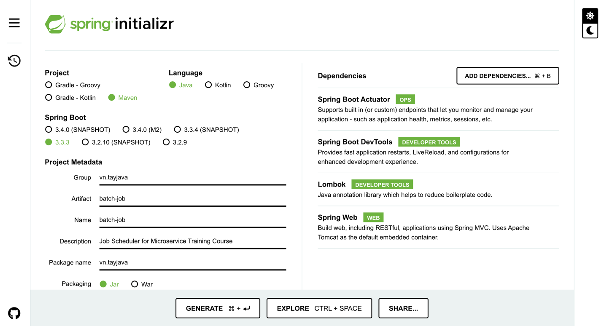

# Thiết Kế codeBase Microservice Theo Mô Hình Tuỳ Chọn và Triển Khai Trên Kubernetes



## 1. API gateway (Spring Cloud gateway)

- Tạo ___API Gateway___ tại [Spring Initializr](https://start.spring.io/)



- Cấu hình `API gateway` tại `application.yml`
```yml
server:
  port: 4953

spring:
  application:
    name: api-gateway
  cloud:
    gateway:
      routes: # điều hướng request đến service tương ứng thông qua chỉ định trên url
        - id: authentication-service
          uri: http://localhost:8081
          predicates:
            - Path=/auth/** # chỉ định url có chứa ký tự /auth
          filters:
            - RewritePath=/auth/(?<segment>.*), /$\{segment} # thay thế ký tự /auth/ thành /
        - id: account-service
          uri: http://localhost:8082
          predicates:
            - Path=/account/** # chỉ định url có chứa ký tự /account
          filters:
            - RewritePath=/account/(?<segment>.*), /$\{segment} # thay thế ký tự /account/ thành /

management: # cho phép hiển thị thông tin sức khoẻ của service
  endpoints:
    web:
      exposure:
        include: '*'
```

- Khởi động `API Gateway`
```bash
$ ./mvnw spring-boot:run
```

- Kiểm tra sức khoẻ của `API Gateway` bằng command line
```bash
$ curl --location 'http://localhost:4953/actuator/health'
{
    "status": "UP"
}
```
---

## 2. Authentication service (microservice)

- Tạo ___Authentication service___ tại [Spring Initializr](https://start.spring.io/)



- Cấu hình `Authentication service` tại `application.yml`
```yml
server:
  port: 8081

spring:
  application:
    name: authentication-service

management: # cho phép hiển thị thông tin sức khoẻ của service
  endpoints:
    web:
      exposure:
        include: '*'
```

- Tạo api `/access-token`
```java
@RestController
public class AuthenticationController {

    @PostMapping("/access-token")
    public String accessToken() {
        return "Access Token";
    }
}
```

- Khởi động `Authentication service`
```bash
$ ./mvnw spring-boot:run
```

- Kiểm tra sức khoẻ của `Authentication service` bằng command line
```bash
$ curl --location 'http://localhost:8081/actuator/health'

{
    "status": "UP"
}
```

- Test api `/access-token`
```bash
$ curl --location --request POST 'http://localhost:8081/access-token'

Access Token
```
- Test api `/access-token` với `API Gateway`
```bash
$ curl --location --request POST 'http://localhost:4953/auth/access-token'

Access Token
```
> API Gateway sẽ điều hướng request `/auth/access-token` tới Authentication service dựa vào từ khoá `/auth/` chứa trong request `http://localhost:4953/auth/access-token`
---

## 3. Account service (microservice)

- Tạo ___Account service___ tại [Spring Initializr](https://start.spring.io/)



- Cấu hình `Account service` tại `application.yml`
```yml
server:
  port: 8082

spring:
  application:
    name: account-service

management: # cho phép hiển thị thông tin sức khoẻ của service
  endpoints:
    web:
      exposure:
        include: '*'
```

- Tạo api `/user/list`
```java
@RestController
@RequestMapping("/user")
public class UserController {

    @GetMapping("/list")
    public String getAll() {
        return "user list";
    }
}
```

- Khởi động `Account service`
```bash
$ ./mvnw spring-boot:run
```

- Kiểm tra sức khoẻ của `Account service` bằng command line
```bash
$ curl --location 'http://localhost:8082/actuator/health'

{
    "status": "UP"
}
```

- Test api `/user/list`
```bash
$ curl --location 'http://localhost:8082/user/list'

user list
```
- Test api `/user/list` với `API Gateway`
```bash
$ curl --location 'http://localhost:4953/account/user/list'

user list
```
> API Gateway sẽ điều hướng request `/account/user/list` tới Account service dựa vào từ khoá `/account/` chứa trong request `http://localhost:4953/account/user/list`
---

## 4. Product service (microservice)

- Tạo ___Product service___ tại [Spring Initializr](https://start.spring.io/)



- Cấu hình `Product service` tại `application.yml`
```yml
server:
  port: 8083

spring:
  application:
    name: product-service

management: # cho phép hiển thị thông tin sức khoẻ của service
  endpoints:
    web:
      exposure:
        include: '*'
```

- Tạo api `/product/list`
```java
@RestController
@RequestMapping("/product")
public class ProductController {

    @GetMapping("/list")
    public String getAll() {
        return "product list";
    }
}
```

- Khởi động `Product service`
```bash
$ ./mvnw spring-boot:run
```

- Kiểm tra sức khoẻ của `Product service` bằng command line
```bash
$ curl --location 'http://localhost:8083/actuator/health'

{
    "status": "UP"
}
```

- Test api `/product/list`
```bash
$ curl --location 'http://localhost:8083/product/list'

product list
```
- Test api `/product/list` với `API Gateway`
```bash
$ curl --location 'http://localhost:4953/product/list'

product list
```
> API Gateway sẽ điều hướng request `/product/list` tới Product service dựa vào từ khoá `/product/` chứa trong request `http://localhost:4953/product/list`
---

## 5. Order service (microservice)

- Tạo ___Order service___ tại [Spring Initializr](https://start.spring.io/)


- Cấu hình `Order service` tại `application.yml`
```yml
server:
  port: 8084

spring:
  application:
    name: order-service

management: # cho phép hiển thị thông tin sức khoẻ của service
  endpoints:
    web:
      exposure:
        include: '*'
```

- Tạo api `/order/list`
```java
@RestController
@RequestMapping("/order")
public class OrderController {

    @GetMapping("/list")
    public String getAll() {
        return "order list";
    }
}
```

- Khởi động `Order service`
```bash
$ ./mvnw spring-boot:run
```

- Kiểm tra sức khoẻ của `Order service` bằng command line
```bash
$ curl --location 'http://localhost:8084/actuator/health'

{
    "status": "UP"
}
```

- Test api `/order/list`
```bash
$ curl --location 'http://localhost:8084/order/list'

order list
```
- Test api `/order/list` với `API Gateway`
```bash
$ curl --location 'http://localhost:4953/order/list'

order list
```
> API Gateway sẽ điều hướng request `/order/list` tới Product service dựa vào từ khoá `/order/` chứa trong request `http://localhost:4953/order/list`
---

## 6. Payment service (microservice)

- Tạo ___Payment service___ tại [Spring Initializr](https://start.spring.io/)


- Cấu hình `Payment service` tại `application.yml`
```yml
server:
  port: 8085

spring:
  application:
    name: payment-service

management: # cho phép hiển thị thông tin sức khoẻ của service
  endpoints:
    web:
      exposure:
        include: '*'
```

- Khởi động `Payment service`
```bash
$ ./mvnw spring-boot:run
```

- Kiểm tra sức khoẻ của `Payment service` bằng command line
```bash
$ curl --location 'http://localhost:8085/actuator/health'

{
    "status": "UP"
}
```

> Payment service sẽ không public bất kỳ endpoint nào mà nó chỉ giao tiếp với các service khác thông qua Kafka, gRPC trong mạng nội bộ
---

## 7. Inventory service (microservice)

- Tạo ___Inventory service___ tại [Spring Initializr](https://start.spring.io/)



- Cấu hình `Inventory service` tại `application.yml`
```yml
server:
  port: 8086

spring:
  application:
    name: inventory-service

management: # cho phép hiển thị thông tin sức khoẻ của service
  endpoints:
    web:
      exposure:
        include: '*'
```

- Tạo api `/inventory/list`
```java
@RestController
@RequestMapping("/inventory")
public class InventoryController {

    @GetMapping("/list")
    public String getAll() {
        return "inventory list";
    }
}
```

- Khởi động `Inventory service`
```bash
$ ./mvnw spring-boot:run
```

- Kiểm tra sức khoẻ của `Inventory service` bằng command line
```bash
$ curl --location 'http://localhost:8086/actuator/health'

{
    "status": "UP"
}
```

- Test api `/inventory/list`
```bash
$ curl --location 'http://localhost:8086/inventory/list'

inventory list
```
- Test api `/inventory/list` với `API Gateway`
```bash
$ curl --location 'http://localhost:4953/inventory/list'

inventory list
```
> API Gateway sẽ điều hướng request `/inventory/list` tới Inventory service dựa vào từ khoá `/inventory/` chứa trong request `http://localhost:4953/inventory/list`
---

## 8. Mail service (microservice)

- Tạo ___Mail service___ tại [Spring Initializr](https://start.spring.io/)



- Cấu hình `Mail service` tại `application.yml`
```yml
server:
  port: 8087

spring:
  application:
    name: mail-service

management: # cho phép hiển thị thông tin sức khoẻ của service
  endpoints:
    web:
      exposure:
        include: '*'
```

- Tạo api `/mail/send`
```java
@RestController
@RequestMapping("/mail")
public class MailController {

    @PostMapping("/send")
    public String send() {
        return "sent";
    }
}
```

- Khởi động `Send service`
```bash
$ ./mvnw spring-boot:run
```

- Kiểm tra sức khoẻ của `Send service` bằng command line
```bash
$ curl --location 'http://localhost:8087/actuator/health'

{
    "status": "UP"
}
```

- Test api `/mail/send`
```bash
$ curl --location --request POST 'http://localhost:8087/mail/send'

sent
```
- Test api `/mail/send` với `API Gateway`
```bash
$ curl --location --request POST 'http://localhost:4953/mail/send'

sent
```
> API Gateway sẽ điều hướng request `/mail/send` tới Mail service dựa vào từ khoá `/mail/` chứa trong request `http://localhost:4953/mail/send`
---

## 9. Notification service (microservice)

- Tạo ___Notification service___ tại [Spring Initializr](https://start.spring.io/)


- Cấu hình `Payment service` tại `application.yml`
```yml
server:
  port: 8088

spring:
  application:
    name: notification-service

management: # cho phép hiển thị thông tin sức khoẻ của service
  endpoints:
    web:
      exposure:
        include: '*'
```

- Khởi động `Notification service`
```bash
$ ./mvnw spring-boot:run
```

- Kiểm tra sức khoẻ của `Notification service` bằng command line
```bash
$ curl --location 'http://localhost:8088/actuator/health'

{
    "status": "UP"
}
```

> Notification service sẽ không public bất kỳ endpoint nào mà nó chỉ giao tiếp với các service khác thông qua Kafka, gRPC trong mạng nội bộ
---

## 10. Batch Job (microservice)

- Tạo ___Batch Job___ tại [Spring Initializr](https://start.spring.io/)



- Cấu hình `Batch Job` tại `application.yml`
```yml
server:
  port: 8089

spring:
  application:
    name: batch-job

management: # cho phép hiển thị thông tin sức khoẻ của service
  endpoints:
    web:
      exposure:
        include: '*'
```

- Khởi động `Batch Job`
```bash
$ ./mvnw spring-boot:run
```

- Kiểm tra sức khoẻ của `Batch Job` bằng command line
```bash
$ curl --location 'http://localhost:8089/actuator/health'

{
    "status": "UP"
}
```
