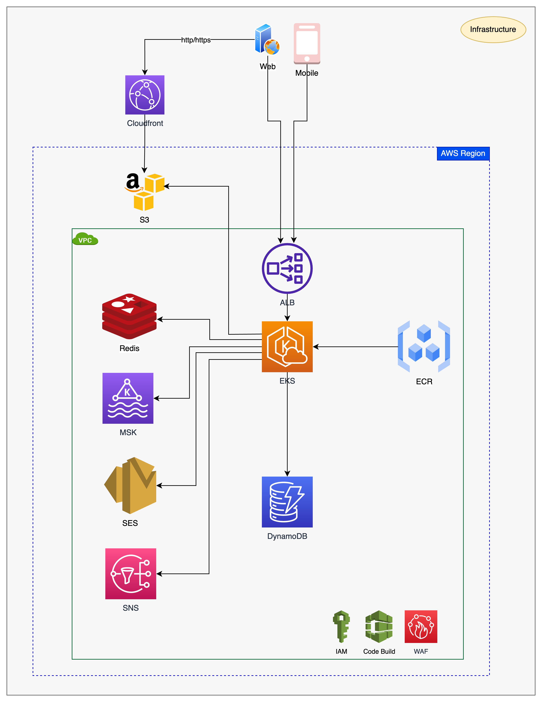

# Thiết Kế Kiến Trúc Hạ Tầng Để Triển Khai Ứng Dụng Microservice

### 1. Cài đặt công cụ thiết kế Draw.io
Download và cài đặt [drawio](https://www.drawio.com/)

### 2. Các thành phần cần có của một ứng dụng Microservice là gì ?
- Microservice
  - API Gateway
  - Authentication Service
  - Account Service
  - Product Service
  - Order Service
  - Payment Service
  - Inventory Service
  - Mail Service
  - Notification Service
  - Batch-Job
- Các thành phần bắt buộc phải có
  - Domain
  - Load balancer
  - DNS
  - Message Queue
  - Storage
  - Database
  - Hub/Repository
  - EKS/ECS/Elastic Bean Talk
  - Network
  - VPC
  - Proxy

### 3. Thực hành vẽ infra
