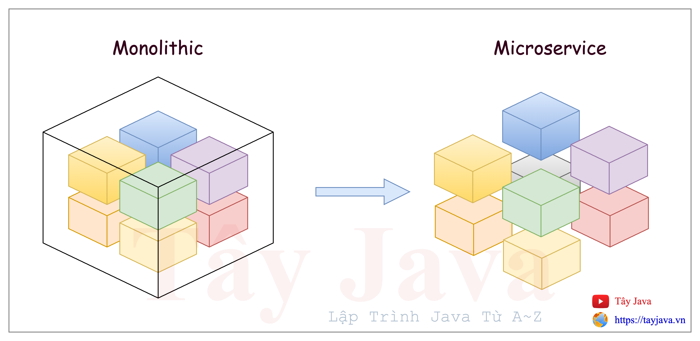

# Tổng quan về kiến trúc microservice

## 1. Microservice là gì ?
Là một kỹ thuật sản xuất phần mềm trong đó mỗi chức năng của một ứng dụng được thiết và phát triển để có thể triển khai và hoạt động độc lập.
Giữa các microservice kết nối và truyền thông tin đến nhau thông qua các phương thức lỏng lẻo như: HTTP, gRPC và Kafka.
- Ví dụ: 
  - Chức năng authentication -> authentication service
  - Chức năng quản lý user -> account-service
  - Chức năng gửi email -> mail service

Tóm lại: micro là siêu nhỏ, microservice là dịch vụ siêu nhỏ. Các microservice này được thiết kế nhỏ gọn và hoạt động độc lập.

## 2. Ưu / nhược điểm của kiến trúc microservice
### 2.1 Ưu điểm của kiến trúc microservices
- Cải thiện khả năng mở rộng:
>  Vì mỗi microservice chạy độc lập nên việc thêm, xóa, cập nhật hoặc mở rộng từng microservice trở nên dễ dàng hơn. Các developer có thể thực hiện phát triển hoặc bảo trì mà không làm gián đoạn bất kỳ microservice nào khác trong hệ thống. Các công ty có thể mở rộng từng microservice khi cần.

- Cải thiện khả năng cô lập lỗi
>  Theo kiến trúc monolithic, khi các developer gặp lỗi ở một thành phần trong kiến trúc, nó sẽ làm gián đoạn tất cả các thành phần kiến trúc. Với kiến trúc microservice, nếu một microservice bị lỗi, khả năng các phần khác của ứng dụng bị lỗi sẽ thấp hơn nhiều vì mỗi vi dịch vụ chạy độc lập. Tuy nhiên, các doanh nghiệp cần phải cẩn thận, vì khối lượng lớn lưu lượng vẫn có thể gây quá tải trong một số trường hợp.

>  Lợi ích của kiến trúc microservice là các developer có thể triển khai các tính năng ngăn ngừa lỗi trồng lỗi. Nhiều công cụ khác nhau cũng có sẵn, từ GitLab và các công cụ khác, để xây dựng các microservice chịu lỗi giúp cải thiện khả năng phục hồi của cơ sở hạ tầng.

- Ngôn ngữ lập trình và công nghệ độc lập
> Một ứng dụng microservice có thể được lập trình bằng bất kỳ ngôn ngữ nào, do đó, các developer có thể chọn ngôn ngữ tốt nhất cho công việc. Thực tế là kiến trúc microservice không phụ thuộc vào ngôn ngữ cũng cho phép các developer sử dụng các kỹ năng hiện có của họ để đạt được lợi thế tối đa – không cần phải học ngôn ngữ lập trình mới chỉ cần hoàn thành công việc. Sử dụng microservice dựa trên đám mây mang lại cho các nhà phát triển một lợi thế khác, vì họ có thể truy cập ứng dụng từ bất kỳ thiết bị nào được kết nối internet, bất kể nền tảng của nó.

- Triển khai dễ dàng hơn
> Kiến trúc microservice cho phép các nhóm triển khai các ứng dụng độc lập mà không ảnh hưởng đến các dịch vụ khác trong kiến trúc. Tính năng này, một trong những ưu điểm của microservice, sẽ cho phép các nhà phát triển thêm các developer mới mà không cần thiết kế lại toàn bộ cấu trúc của hệ thống. Các doanh nghiệp có thể thêm các tính năng mới một cách hiệu quả khi cần thiết theo kiến trúc microservice.

- Khả năng tái sử dụng trên nhiều lĩnh vực kinh doanh khác nhau
> Một số ứng dụng microservice có thể được chia sẻ trên toàn doanh nghiệp. Nếu một trang web có nhiều lĩnh vực khác nhau, mỗi lĩnh vực có tùy chọn đăng nhập hoặc thanh toán, thì có thể sử dụng cùng một ứng dụng dịch vụ siêu nhỏ trong mỗi trường hợp.

- Thời gian đưa ra thị trường nhanh hơn
> Các nhà phát triển có thể cắm microservice mới này vào kiến trúc mà không sợ xung đột với microservice được viết từ ngôn ngữ lập trình khác hoặc tạo ra sự cố dịch vụ lan rộng trên toàn bộ trang web. Các nhóm phát triển làm việc trên các microservice khác nhau không phải chờ nhau hoàn thành. Các công ty có thể phát triển và triển khai các tính năng mới một cách nhanh chóng và nâng cấp các thành phần cũ hơn khi các công nghệ mới cho phép chúng phát triển.

- Khả năng thử nghiệm
> Quyết định tiến hành thử nghiệm dễ dàng hơn nhiều với kiến microservice.

> Việc triển khai các tính năng mới rất đơn giản vì mỗi dịch vụ đều độc lập với các dịch vụ khác. Nếu khách hàng không thích hoặc lợi ích kinh doanh không rõ ràng, việc khôi phục tính năng đó mà không ảnh hưởng đến phần còn lại của hoạt động sẽ dễ dàng hơn nhiều.

> Nếu một tính năng mới là yêu cầu của khách hàng, kiến trúc microservice có nghĩa là họ sẽ được trải nghiệm tính năng đó trong vài tuần, thay vì vài tháng hoặc vài năm.

- Bảo mật dữ liệu được cải thiện
> Nếu các thành phần của kiến trúc hệ thống máy tính bị chia nhỏ thành các phần nhỏ hơn, dữ liệu nhạy cảm sẽ được bảo vệ khỏi sự xâm nhập từ một khu vực khác. Mặc dù có các kết nối giữa tất cả các microservice, nhưng các nhà phát triển có thể sử dụng API an toàn để kết nối các microservice. API an toàn bảo vệ dữ liệu bằng cách đảm bảo dữ liệu chỉ khả dụng cho người dùng, ứng dụng và máy chủ được ủy quyền cụ thể. Nếu một doanh nghiệp yêu cầu xử lý dữ liệu nhạy cảm như thông tin sức khỏe hoặc tài chính, thì việc tuân thủ theo các tiêu chuẩn bảo mật dữ liệu như HIPAA của ngành chăm sóc sức khỏe hoặc GDPR của Châu Âu sẽ dễ dàng hơn.

- Tính linh hoạt của việc thuê ngoài
> Một doanh nghiệp có thể cần thuê ngoài một số chức năng nhất định cho các đối tác bên thứ ba. Nhiều công ty lo ngại về việc bảo vệ sở hữu trí tuệ bằng định dạng kiến trúc đơn khối. Tuy nhiên, kiến trúc microservice cho phép các doanh nghiệp phân đoạn các khu vực chỉ dành cho các đối tác không tiết lộ các dịch vụ cốt lõi.

- Tối ưu hóa nhóm phát triển theo Agile
> Khi cân nhắc quy mô của các nhóm mà bạn chỉ định cho từng microservice, hãy xem xét quy tắc hai chiếc bánh pizza. Được Amazon, công ty tiên phong trong dịch vụ siêu nhỏ, đưa ra lần đầu tiên, ý tưởng là giữ cho các nhóm phát triển đủ nhỏ để có thể cung cấp cho họ hai chiếc bánh pizza. Các chuyên gia giải thích rằng nguyên tắc này cải thiện hiệu quả công việc, cho phép các doanh nghiệp đạt được mục tiêu nhanh hơn, giúp quản lý nhóm dễ dàng hơn, tạo sự tập trung lớn hơn trong nhóm và tạo ra các sản phẩm chất lượng cao hơn.

- Hấp dẫn đối với các kỹ sư
> Các kỹ sư thấy kiến trúc microservices hấp dẫn và các công ty có nhiều cơ hội hơn trong việc tìm kiếm những tài năng hàng đầu để làm việc phát triển ứng dụng microservice. Microservice dựa trên các phương pháp kỹ thuật và công cụ dành cho nhà phát triển mới nhất. Điều này mang lại lợi thế quan trọng cho các doanh nghiệp hy vọng thu hút được các chuyên gia.

### 2.2 Nhược điểm của microservice
> Mặc dù có rất nhiều lợi thế các doanh nghiệp, nhưng cũng có một số nhược điểm của microservice cần cân nhắc trước khi áp dụng.

- Chi phí trả trước và chi phí vận hành cao hơn với các microservice
> Mặc dù các microservice có ưu điểm là tiết kiệm tiền trong thời gian dài, nhưng cũng có nhược điểm là chi phí liên quan đến việc triển khai ban đầu. Một doanh nghiệp cần có cơ sở hạ tầng lưu trữ đủ với hỗ trợ bảo mật và bảo trì. Quan trọng hơn nữa, doanh nghiệp sẽ cần các nhóm có tay nghề cao để quản lý tất cả các dịch vụ.

- Kiểm soát giao diện là rất quan trọng
> Vì mỗi microservice có API riêng, nên bất kỳ ứng dụng nào sử dụng dịch vụ đó sẽ bị ảnh hưởng nếu bạn thay đổi API và thay đổi đó không tương thích ngược. Bất kỳ hoạt động lớn nào sử dụng kiến trúc microservice sẽ có hàng trăm, thậm chí hàng nghìn API, do đó việc kiểm soát các endpoint đó trở nên quan trọng đối với hoạt động của doanh nghiệp, điều này có thể là bất lợi đối với kiến trúc microservice.

- Một loại phức tạp khác
> Gỡ lỗi có thể khó khăn hơn với kiến trúc microservice. Mỗi microservice sẽ có bộ logging riêng. Điều này gây ra một chút đau đầu khi theo dõi nguồn gốc của sự cố trong code.

- Kiểm thử tích hợp
> Unit test dễ quản lý hơn với kiến trúc microservice nhưng Integration test thì không vì kiến trúc phân phối từng microservice nên các developer không thể kiểm tra toàn bộ hệ thống từ máy của họ.

- Kiến trúc SOA (Service-oriented architecture) so với kiến trúc microservice
> Nếu bạn làm việc với điện toán đám mây, bạn có thể biết về cuộc tranh luận về kiến trúc hướng dịch vụ (SOA) so với dịch vụ siêu nhỏ. Theo nhiều cách, hai kiến trúc này tương tự nhau vì cả hai đều liên quan đến điện toán đám mây để phát triển nhanh nhẹn. Cả hai đều chia các thành phần đơn khối lớn thành các đơn vị nhỏ hơn dễ làm việc hơn.

> Sự khác biệt lớn nhất là SOA là phương pháp tiếp cận toàn doanh nghiệp để phát triển các thành phần phần mềm. Trong khi đó, microservice xây dựng các ứng dụng độc lập thực hiện một chức năng cụ thể và phương pháp tiếp cận clound này để phát triển và triển khai khiến chúng có khả năng mở rộng, linh hoạt và bền bỉ hơn.

> Vì vậy, về bản chất, sự khác biệt giữa hai kiến trúc này nằm ở phạm vi. SOA là phương pháp tiếp cận toàn doanh nghiệp, trong khi kiến trúc microservice có phạm vi ứng dụng.

---
Source refers: 
  - [What are the benefits of a microservices architecture?](https://about.gitlab.com/blog/2022/09/29/what-are-the-benefits-of-a-microservices-architecture/#outsourcing-flexibility)
  - [Service-Oriented Architecture (SOA)](https://www.techtarget.com/searchapparchitecture/definition/service-oriented-architecture-SOA)

## 3. Các use case sử dụng microservice
- Theo quan điểm kinh doanh
  - Nền tảng thương mại điện tử
  - Dịch vụ phát trực tuyến phương tiện truyền thông
  - Ứng dụng du lịch và khách sạn
  - Dịch vụ tài chính và ngân hàng
  - Internet vạn vật (IoT)
  - Nền tảng truyền thông xã hội
  - Trò chơi và giải trí
  - Chăm sóc sức khỏe và y tế từ xa
- Theo quan điểm kỹ thuật
  - Ứng dụng lỗi thời
  - Ứng dụng có logic phức tạp
  - Ứng dụng nặng về dữ liệu
  - Ứng dụng xử lý dữ liệu thời gian thực
  - Ứng dụng có khả năng phục hồi cao
---
Source refers:
  - [Use Cases of Microservices Architecture](https://dev.to/sardarmudassaralikhan/use-cases-of-microservices-architecture-4lck)
  - [Microservices Use Cases and Real-World Examples](https://codeit.us/blog/microservices-use-cases)

## 4. Giới thiệu các mô hình microservice hiện nay

---
## Câu hỏi phỏng vấn
